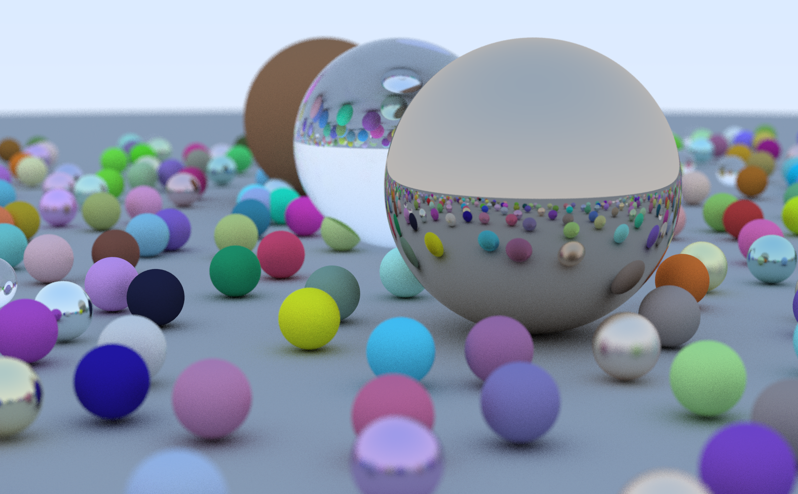
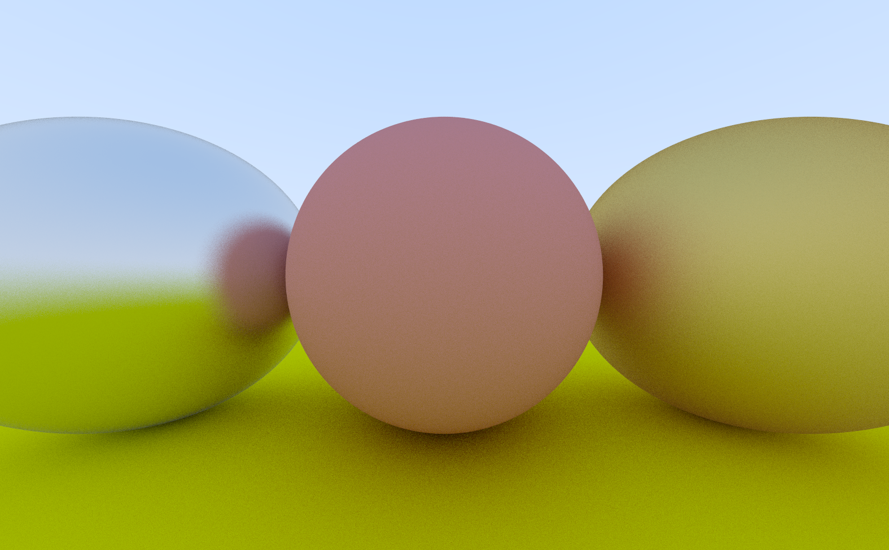
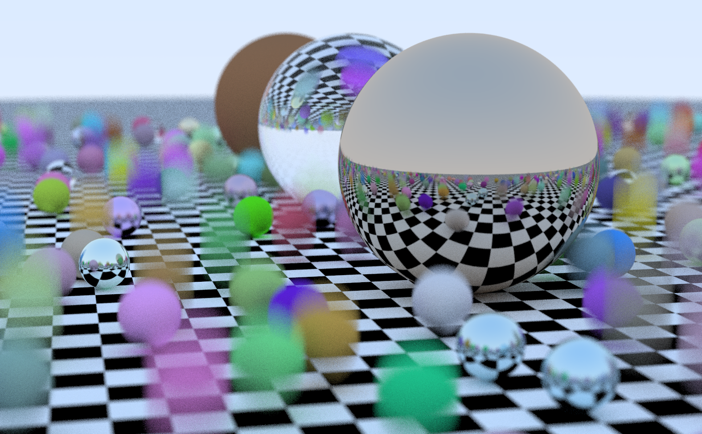
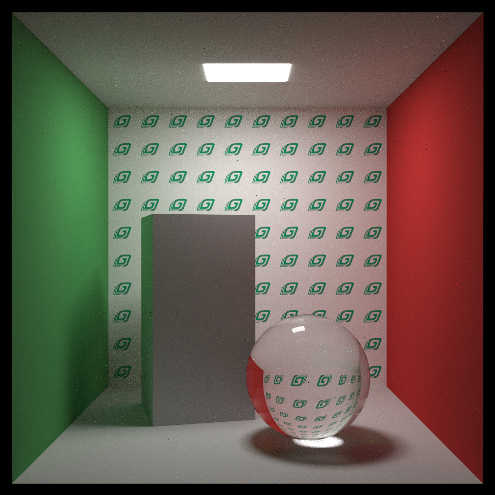

# Ray-tracing :camera:

Implementation of ray-tracing book series (One weekend, One week, Life) in C++. These books are public for free and can be found in https://raytracing.github.io/.

## Results of first book

| Procedural scene    | Spheres |
| -------- | ------- |
|   |     |

## Results of second book

| Procedural scene    | Cornell box |
| -------- | ------- |
|   |     |

## Results of third book

